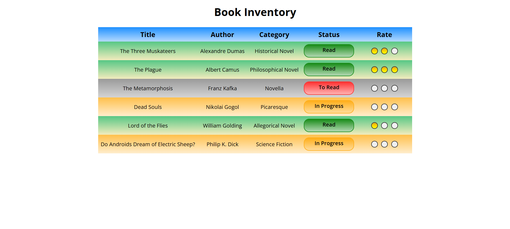

# Book Inventory App

## A Simple Landing Page for a Book Inventory App

This responsive project displays a book inventory in a clean table layout using only HTML and CSS.

It was built entirely with HTML and CSS as part of the **[freeCodeCamp.org](https://www.freecodecamp.org/learn/full-stack-developer/)** CSS course.

---

## Overview

This project demonstrates how to present data clearly in a tabular format using semantic HTML elements and creative CSS design. Each row of the table represents a book, including its title, author, category, status, and a visual rating bubble using gradients.

The table is color-coded by reading status (_Read_, _In Progress_, and _To Read_) to enhance readability which also features accessibility.

---

## Features

- Table-based book inventory layout
- Row backgrounds color-coded by reading status
- Visual 3-dot rating system using gradients
- Semantic HTML and accessible markup

---

## Tech Used

- HTML5
- CSS3
- Git
- GitHub
- Netlify

